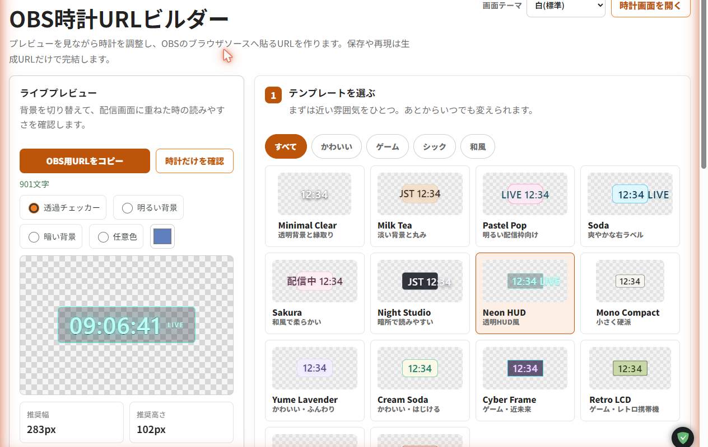

# OBS Clock Overlay Builder

[](LICENSE)
[](https://obs-clock-overlay-builder.h8nc4y.workers.dev)

A zero-runtime-dependency static builder for transparent OBS browser-source clock overlay URLs.

Demo: https://obs-clock-overlay-builder.h8nc4y.workers.dev

## Features

- Transparent OBS clock overlay with a dedicated clock-only `/clock/` surface.
- Reproducible `/clock/?c=...` URL contract for OBS browser sources.
- Clock auto-corrects to server time via the same-origin HTTP `Date` header, so it stays accurate even when the PC clock is off; it falls back to local time when offline. No backend is added.
- 17 built-in templates across five categories (standard, cute, cool, analog, flip).
- Zero runtime dependencies; the clock renders from URL and browser state only.
- Static-first, free-tier-friendly Cloudflare Workers Static Assets hosting.
- Japanese-first editor UI for non-programmer OBS users in Japan.
- Optional browser features for local font discovery and clipboard copy.



## Quick Start For OBS

1. Open the builder demo or run it locally.
2. Customize the clock style in the editor.
3. Copy the generated `/clock/?c=...` URL.
4. Add an OBS Browser Source and paste that generated URL into the URL field.
5. Use the recommended width and height shown by the editor. If any glow or text is clipped, add 20px to 80px in OBS.
6. Keep the OBS source background transparent and avoid custom CSS that forces a background color.

The OBS clock auto-corrects to server time using the same-origin HTTP `Date` header, so it stays accurate even when the computer's clock is off; it falls back to the local system clock when offline. No backend is added.

## Reproducibility Contract

The generated URL is the source of truth:

```text
/clock/?c=<base64url encoded config>
```

- All visual state needed by `/clock/` is encoded into `?c=...`.
- `/clock/` must not depend on editor `localStorage`.
- Editor `localStorage` may help restore draft editing state, but it is not required for OBS playback.
- Keep the generated `/clock/?c=...` URL with your OBS scene if you need to reproduce the same appearance later.
- Invalid or unsupported URL values are normalized to safe defaults.
- URL-provided labels and font names are rendered as text, not HTML.

Older flat query parameters are still read for compatibility, for example:

```text
/clock/?tz=Asia/Tokyo&hour12=0&seconds=1&date=0&weekday=0&font=system-ui&theme=soda
```

## Privacy

- No account is required.
- There is no backend database.
- Clock rendering is based on the URL and the local browser runtime.
- This app does not intentionally send user clock configuration to its server.
- Local font discovery and clipboard are optional browser features. Browser permission prompts and browser behavior depend on the user's environment.
- The clock fetches the same-origin `/api/defaults` with `no-store` only to read the response `Date` header for time correction; no clock configuration or personal data is sent.

## Security

- A strict `Content-Security-Policy` is sent on every response (plus `X-Content-Type-Options: nosniff` and `Referrer-Policy: no-referrer`). It allows only same-origin scripts and styles and uses no inline scripts or styles. It intentionally does not restrict framing, so `/clock/` stays embeddable as an OBS browser source.
- URL-provided labels and font names are rendered as text, never as HTML.
- No backend, no database, no secrets, and no third-party network requests.

## Development

Install dependencies once, then use the npm scripts:

```bash
npm install
npm run dev
npm test
npm run build
npm run release:check
```

Local URLs:

- Builder: `http://localhost:4173/`
- Clock surface: `http://localhost:4173/clock/`

Useful checks:

```bash
npm run lint
npm run typecheck
npm run format:check
npm test
npm run build
```

Notes:

- `npm run lint` is JavaScript syntax checking with `node --check`, not ESLint.
- `npm run typecheck` is a module/import smoke check, not TypeScript checking.
- `npm test` runs the Node test suite; the build test builds into a temporary directory, so it does not touch your `dist/` (`npm run build` is what writes `dist/`).
- `npm run release:check` includes `cf:dry-run`; run it only when Wrangler dry-run is safe in your environment.

## Deployment

The preferred deployment target is Cloudflare Workers with Static Assets. The static output is generated into `dist/`, and `wrangler.jsonc` keeps the Workers Static Assets configuration.

Cloudflare Pages compatibility remains documented because `functions/api/defaults.js` is a harmless optional fallback. The OBS clock surface does not depend on `/api/defaults`.

Remote smoke checks use an explicit base URL:

```bash
SMOKE_BASE_URL=https://example.workers.dev npm run release:remote-smoke
```

Do not deploy, roll back, or run remote smoke checks unless the current release policy allows it.

## Contributing

See [CONTRIBUTING.md](CONTRIBUTING.md).

Key project contracts:

- Preserve `/clock/?c=...` reproducibility.
- Keep `/clock/` clock-only and transparent-background friendly.
- Do not make `/clock/` depend on editor `localStorage`.
- Do not write untrusted URL, label, or font values with `innerHTML`.
- Do not add dependencies, paid services, bundled fonts, or deployment behavior changes without discussion.

Feedback and planning:

- [Feedback guide](docs/FEEDBACK_GUIDE.md)
- [Roadmap](docs/ROADMAP.md)
- [Changelog](CHANGELOG.md)

## AI-Assisted Development

This repository records how ChatGPT, Claude Code, and Codex are used for review triage, implementation, and validation evidence. See [docs/HOW_WE_USE_CODEX.md](docs/HOW_WE_USE_CODEX.md).

## 日本語概要

OBS Clock Overlay Builder は、OBS のブラウザソースに貼り付ける透明な時計オーバーレイ URL を作る静的 Web アプリです。

### このツールでできること

- 配信用の時計オーバーレイをブラウザ上で調整できます。
- 透明背景に対応した `/clock/` の時計専用画面を生成できます。
- 時計の種類を デジタル / アナログ / パタパタ(フリップ) から選べます。テンプレートは全17種(定番 / かわいい / クール / アナログ / パタパタ)。色、文字サイズ、日付・曜日、秒表示、ラベル、フォント名などを設定でき、まずは「かんたん」だけで仕上がります。配信中に時刻が変わっても外枠の幅とコロンの位置は固定されます。
- アナログ時計は文字盤・数字・針・秒針の色、大きさ、目盛り(数字 / ローマ数字 / 目盛り / 両方 / なし)、秒針の動き(なめらか / カチカチ / なし)を選べ、文字盤に日付も表示できます。
- パタパタ時計はカードがめくれるフリップ表示です。色・文字サイズ・角丸・秒表示などを設定できます。
- 編集画面のテーマ(白 / コーラル / ふんわりブルー)を切り替えられます。テーマは編集画面だけの設定で、生成される時計URLの見た目には影響しません。
- 時計はサーバー時刻へ自動補正されるため、配信PCの時計が多少ずれていても正しい時刻を表示します(オフラインなど補正できないときはPCの時刻にフォールバック)。バックエンドは増やしていません。
- 生成された `/clock/?c=...` URL を OBS のブラウザソースへ貼り付けて使えます。

### OBS での使い方

1. ビルダーを開きます。
2. 時計の見た目を調整します。
3. 生成された `/clock/?c=...` URL をコピーします。
4. OBS のブラウザソースに貼り付けます。
5. 推奨幅と推奨高さを OBS に入力します。
6. 背景を透過したまま使う場合は、OBS 側で白背景や強制背景色のカスタム CSS を入れないでください。

### 再現性の約束

- OBS で再現するための正本は生成 URL です。
- `/clock/` は時計だけを表示する面です。
- 時計の見た目に必要な状態は `/clock/?c=...` の `?c=...` に入ります。
- 編集画面の `localStorage` は、編集中の状態を戻しやすくするための補助です。
- OBS 表示は編集画面の `localStorage` に依存せず、生成 URL で再現される必要があります。

### プライバシー

- アカウントは不要です。
- バックエンド DB はありません。
- 時計設定は URL とローカルブラウザ上で扱います。
- このアプリは、ユーザーの時計設定を意図的にサーバーへ送信しません。
- PC 内フォント読み込みとクリップボードは任意のブラウザ機能です。利用可否や許可画面はブラウザ環境に依存します。
- 全レスポンスに厳格な CSP などのセキュリティヘッダを付与し、URL のラベルやフォント名は HTML ではなくテキストとして表示します。`/clock/` は OBS に埋め込めるよう、フレーム表示は制限していません。

### よくある問題

- 背景が白い: `/clock/` は透明背景を想定しています。OBS のブラウザソース設定やカスタム CSS で背景色が付いていないか確認してください。
- フォントが反映されない: OBS を動かす PC に同じフォントが入っていない可能性があります。フォントファイルは同梱していません。
- URL をなくした: 別環境で同じ表示を再現するには、生成された `/clock/?c=...` URL が必要です。
- 時刻がずれる: 時計はサーバー時刻へ自動補正されるため、PC の時計が多少ずれていても正しく表示されます。オフラインなどで補正できないときは PC のシステム時刻を使います。
- OBS で見切れる: エディターの推奨幅・高さより 20px から 80px 程度大きくしてください。

### 開発・貢献

```bash
npm run dev
npm test
npm run build
npm run release:check
```

- 開発手順と PR 期待値は [CONTRIBUTING.md](CONTRIBUTING.md) を確認してください。
- 不具合報告、機能提案、感想は [docs/FEEDBACK_GUIDE.md](docs/FEEDBACK_GUIDE.md) を確認して GitHub Issues へ投稿してください。
- 今後の方向性は [docs/ROADMAP.md](docs/ROADMAP.md)、変更履歴は [CHANGELOG.md](CHANGELOG.md) に記録します。
- チャット/コメント反応(キーワード反応オーバーレイ)は本プロジェクトの対象外で、別プロジェクト `007_yt-live-word-alert-overlay` で扱います。
- ライセンスは [LICENSE](LICENSE) を確認してください。
- ChatGPT、Claude Code、Codex を使った開発フローは [docs/HOW_WE_USE_CODEX.md](docs/HOW_WE_USE_CODEX.md) に記録しています。

## License

MIT. See [LICENSE](LICENSE).
